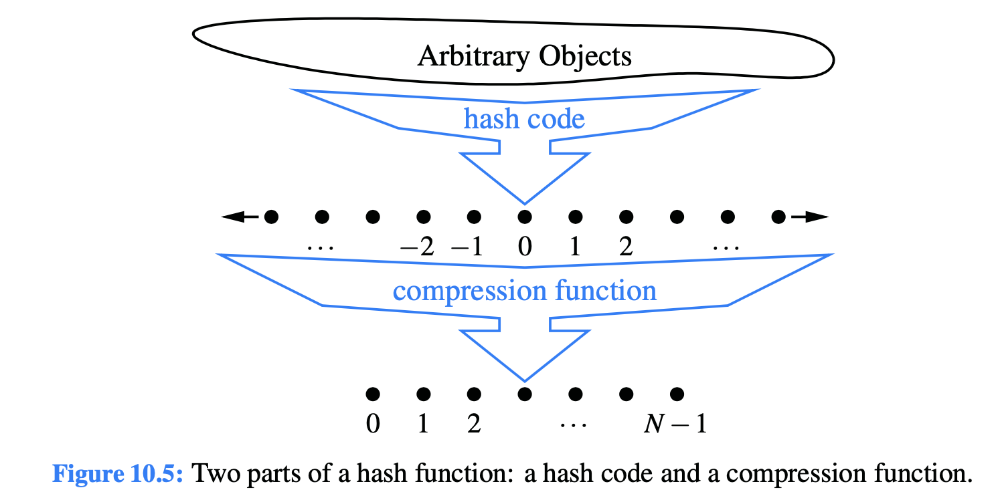

# 10.2.1 Hash Functions

The goal of a **hash function**, h, is to map each key k to an integer in the range \[0, N − 1\], where N is the capacity of the bucket array for a hash table.

**Hash function**, h, the main idea of this approach is to use the hash function value, h\(k\), **as an index into our bucket array**, A, instead of the key k. That is, we store the **entry \(k,v\)** in the **bucket A\[h\(k\)\]**.

**Collision:** If there are two or more keys with the **same hash value**, then two different entries will be mapped to the **same bucket in A**.

**Hash function**, h\(k\), as consisting of two portions:

1. **A hash code** that **maps a key k to an integer**.
2. **A compression function** that maps the hash code to an integer within a range of indices, \[0, N − 1\], for a bucket array.

## Hash Codes

The first action that a **hash function performs** is to take an **arbitrary key k** in our map and **compute an integer** that is called the **hash code for k**; this integer need not be in the range \[0, N − 1\], and may even be negative.

## Compression Functions

The hash code for a key k will typically not be suitable for immediate use with a bucket array, because the integer hash code may be negative or may exceed the capacity of the bucket array.

**Compression Function:** mapping that integer into the range \[0, N − 1\].

### The Division Method

A simple compression function is the **division method**, which maps an integer i to, **i mod N,** where N, **the size of the bucket array**, is a fixed positive integer.

