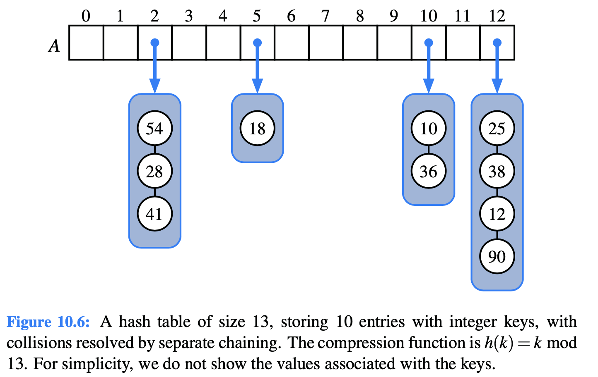
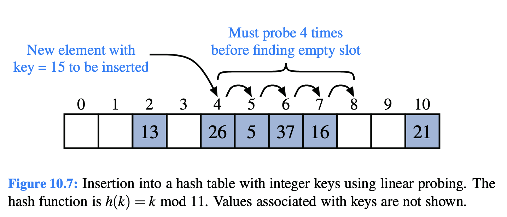
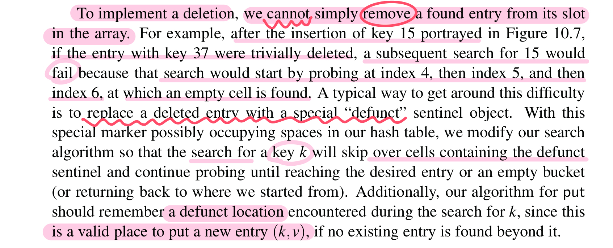
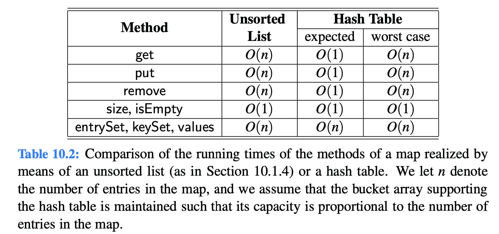

# 10.2.2 Collision-Handling Schemes

The main idea of a hash table is to take a bucket array, A, and a hash function, h, and use them to implement a map by storing each entry \(k,v\) in the “bucket” A\[h\(k\)\].

### Separate Chaining

A simple and efficient way for dealing with collisions is to have each bucket A\[ j\] store its own **secondary container**, holding **all entries \(k,v\) such that h\(k\) = j**.

### Linear Probing and Its Variants

1. if we try to insert an entry \(k, v\) into a bucket A\[ j\] that is already occupied, where j = h\(k\).
2. we next try A\[\(j+**1**\) mod N\]
3. If A\[\(j+1\) mod N\] is also occupied
4. then we try A\[\( j + **2**\) mod N \]
5. so on...until we find an **empty bucket** that can accept the new entry

### Deletion

### Quadratic Probing

Iteratively tries the buckets A\[\(h\(k\)+ f\(i\)\) mod N\], for i = 0,1,2,..., where f\(i\) = $$i^2$$ , until finding an empty bucket.

## Efficiency of Hash Tables

