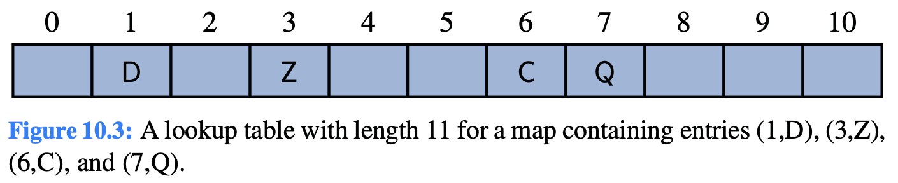

# 10.2 Hash Table

**Hash Table：**The most efficient **data structures** for implementing a map.

A map M supports the abstraction of using keys as “addresses” that help locate an entry.

A map with n entries uses keys that are known to be integers in a range from 0 to N − 1 for some N ≥ n. We can represent the map using a **lookup table** of length N.

We store the value associated with key k at index k of the table. Basic map operations **get, put, and remove** can be implemented in **O\(1\) worst-case time**.

### Two challenges in extending this framework to the more general setting of a map:

1. we may not wish to devote an array of length N if it is the case that N ≫ n.
2. we do not in general require that a map’s keys be integers.

The novel concept for a hash table is the use of a **hash function** to map general keys to corresponding indices in a table.

We will conceptualize our table as a **bucket array,** in which each bucket may manage a collection of entries that are sent to a specific index by the hash function.

