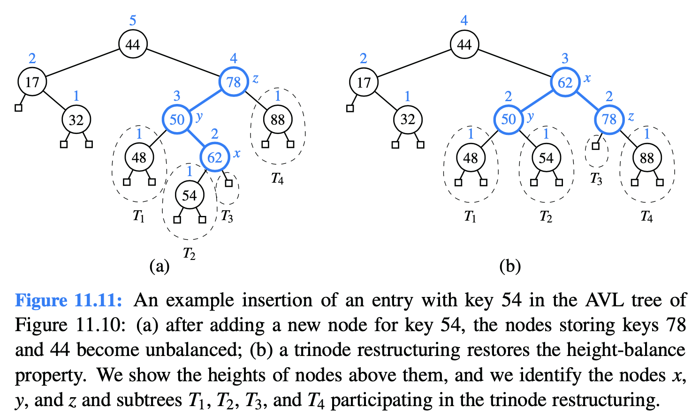
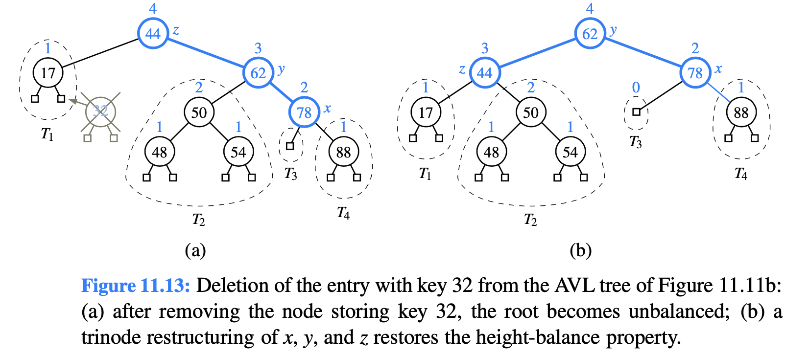
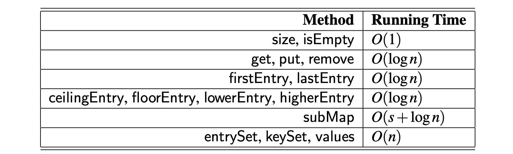
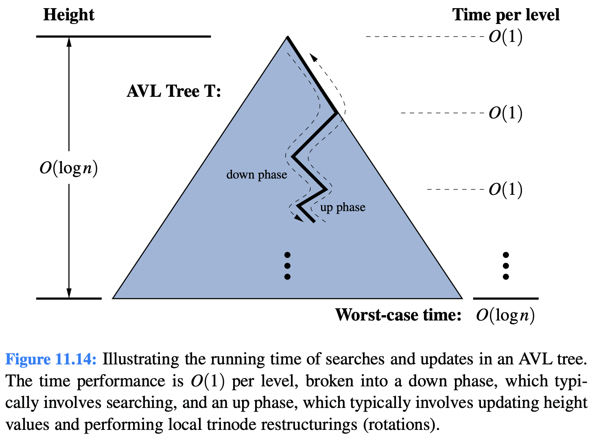

# 11.3.1 Update Operations

### Insertion

An insertion of a new entry in a binary search tree, results in a leaf position p being expanded to become internal, with two new external children. This action may violate the height-balance property. 

### Deletion

 deletion from a regular binary search tree results in the structural removal of a node having either zero or one internal children. Such a change may violate the height-balance property in an AVL tree.

### Performance of AVL Trees

**Worst-case running times** of operations for an n-entry sorted map realized as an AVL tree T, with s denoting the number of entries reported by subMap.

