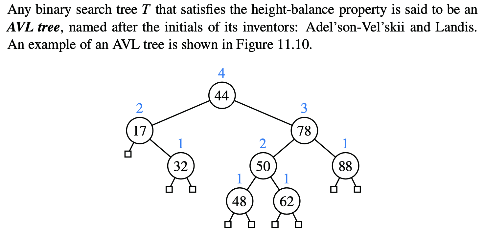

# 11.3 AVL Trees

_**Height-Balance Property:**_ For every internal position p of T , the heights of the children of p differ by _**at most 1.**_


The height of an AVL tree storing n entries is **O\(** _****_$$log_n$$**\)**.


_\*\*\*\*_

