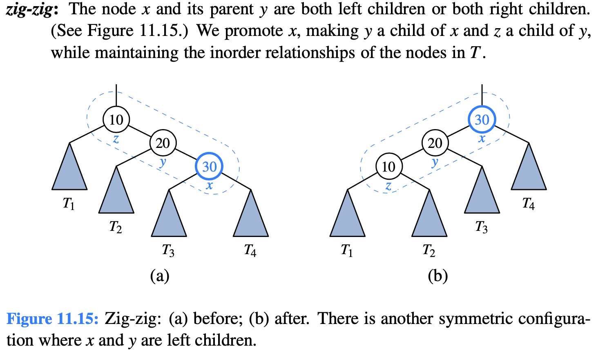
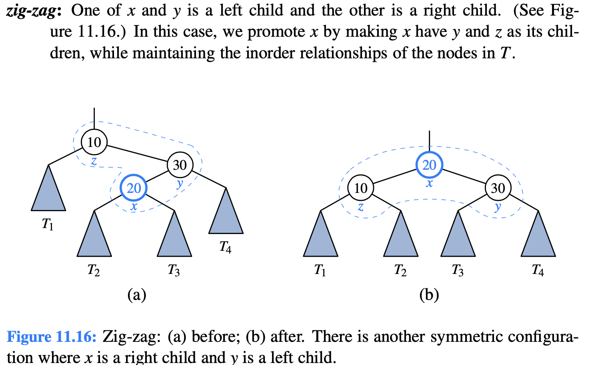
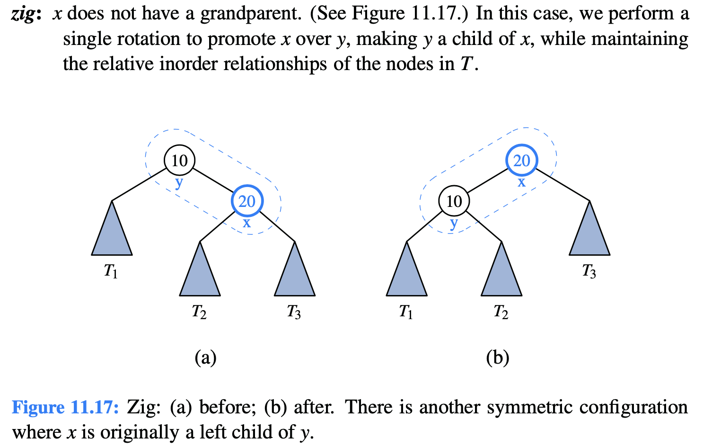

# 11.4.1 Splaying

Given a node x of a binary search tree T, we splay x by moving x to the root of T through a sequence of restructurings.

We perform a **zig-zig** or a **zig-zag** when x has a **grandparent**, and we perform a **zig** when x has a **parent but not a grandparent**. A **splaying** step consists of repeating these restructurings at x until x becomes the root of T .

