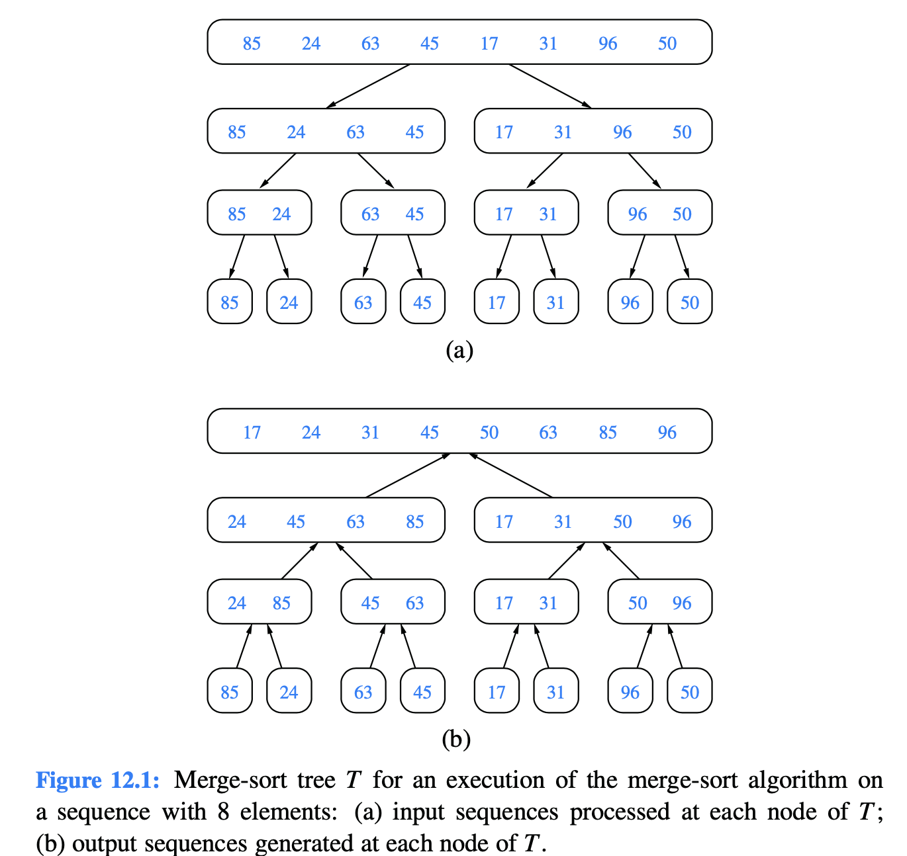

# 12.1.1 Divide-and-Conquer

The divide-and-conquer pattern consists of the following three steps:

1. **Divide:** If the input size is smaller than a certain threshold \(say, one or two elements\), solve the problem directly using a straightforward method and return the solution so obtained. Otherwise, divide the input data into two or more disjoint subsets.
2. **Conquer:** Recursively solve the subproblems associated with the subsets.
3. **Combine**: Take the solutions to the subproblems and merge them into a solution to the original problem.

We can visualize an execution of the merge-sort algorithm by means of a binary tree T , called the **merge-sort tree**.

