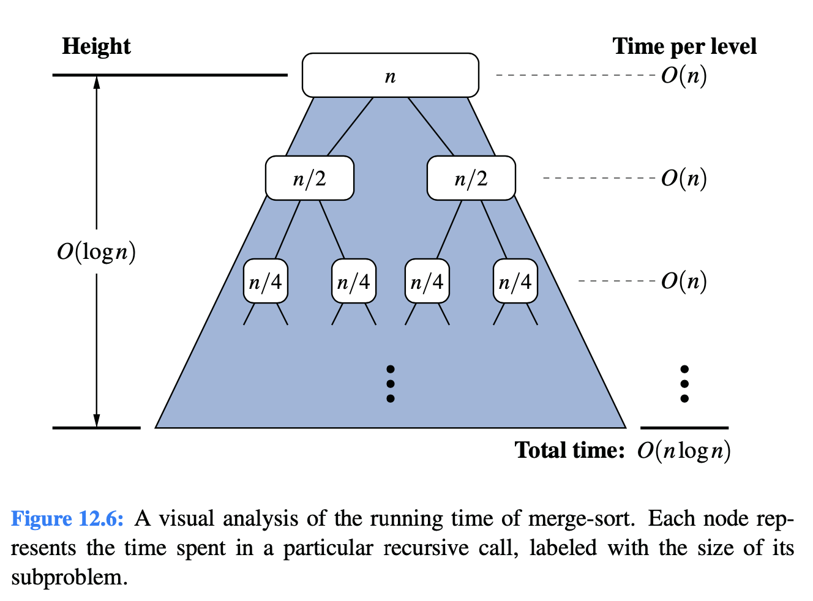
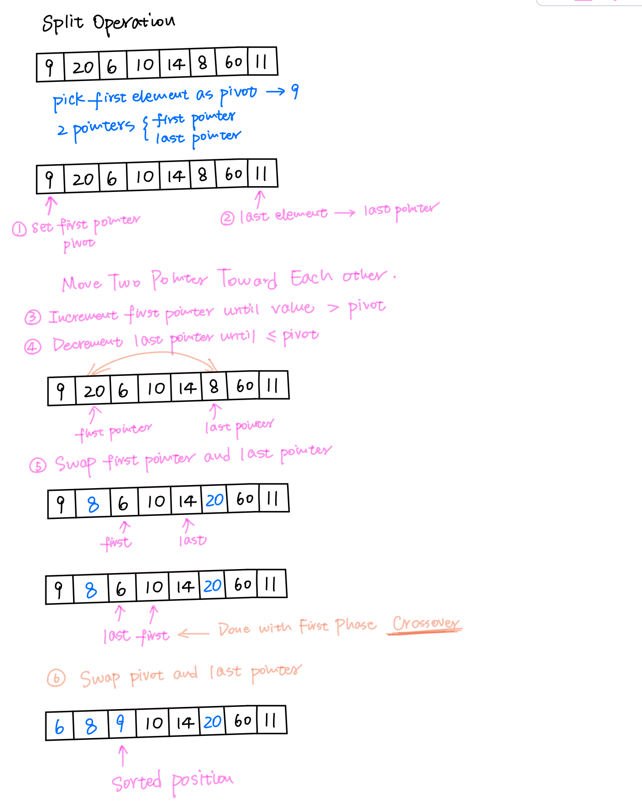
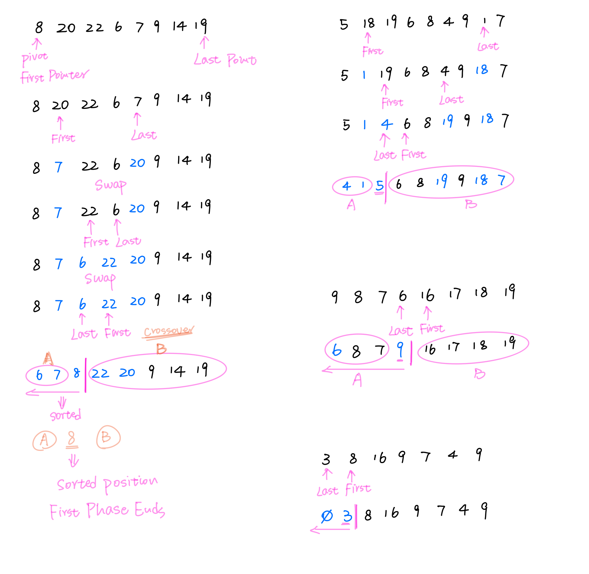

# 12.2 Quick-Sort

ased on the d**ivide-and-conquer p**aradigm

uick-sort algorithm consists of the following three steps：

1.  **Divide:** If S has at least two elements \(nothing needs to be done if S has zero or one element\), select a specific element x from S, which is called the pivot. As is common practice, choose the pivot x to be the last element in S. Remove all the elements from S and put them into three sequences:

   1. storing the elements in S less than x
   2. E, storing the elements in S equal to x
   3. G, storing the elements in S greater than x

   Of course, if the elements of S are distinct, then E holds just one element—

   the pivot itself.

2. **Conquer:** Recursively sort sequences L and G.
3. **Combine:** Put back the elements into S in order by first inserting the elements

   of L, then those of E, and finally those of G.

### Running Time of Quick-Sort

* **Average-case \(expected\): O\(n logn\)**
* **Worst-case: O\(n2\)**

