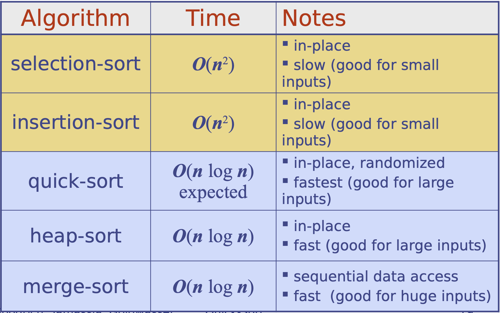

# 12.4 Comparing Sorting Algorithms

### Insertion-Sort

* **O\(n2\)**-time performance
* O\(n + m\), where m is the number of inversions, an **excellent** algorithm for sorting **small sequences** \(say, less than 50 elements\).
* Insertion-sort is quite **effective** for sorting sequences that are already **“almost” sorted** \(the number of inversions is small\).

### Heap-Sort

* **O\(n log n\)** time in the worst case.
* a natural choice on **small- and medium-sized** sequences, when input data can fit into main memory.
* A standard heap-sort does not provide a stable sort, because of the swapping of elements.

### Quick-Sort

* **O\(n2\)**-time **worst-case** performance
* **O\(n log n\) time on average case.**
* Quick-sort does not naturally provide a stable sort, due to the swapping of elements during the partitioning step.

### Merge-Sort

* **O\(n log n\) time** in the **worst case**
* **Memory intensive**

### Bucket-Sort and Radix-Sort

* **O\(d\(n+N\)\) time**, where \[0,N −1\] is the range of integer keys \(and d = 1 for bucket sort\)
* **if d\(n + N\) is significantly “below” the n log n function**, then this sorting method should run faster than even quick-sort, heap-sort, or merge-sort.
* sorting entries with **small integer keys**, **character strings**, or **d-tuples of keys** from a discrete range.

