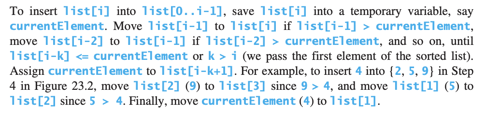
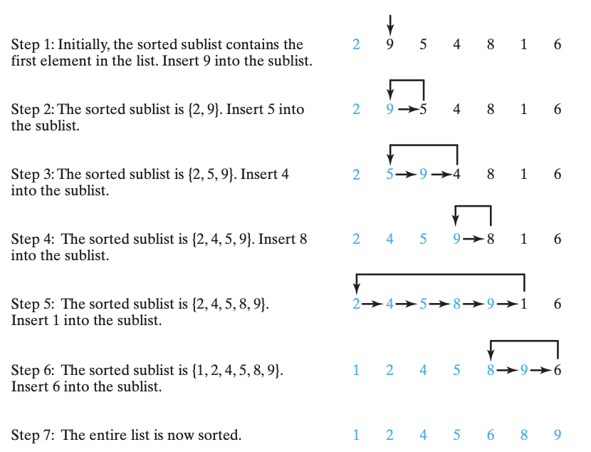
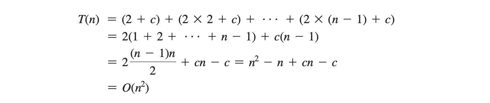

# Insertion Sort 23.2

The insertion-sort algorithm sorts a list of values by repeatedly **inserting a new element into a sorted sublist** until the whole list is sorted.





```java
 public static void insertionSort(int[] list) {
		for (int i = 1; i < list.length; i++) {
			// Insert list[i] into a sorted sublist list[0..i-1] so that list[0..i]is sorted
			int currentElement = list[i];
			int k;
			for (k = i - 1; list[k] > currentElement && k >= 0; k--) { // shift
				list[k + 1] = list[k];
			}
			// Insert the current element into list[k+1]
			list[k + 1] = currentElement;
		}
	}      
            
```

**Insertion sort time complexity**

The insertion sort algorithm presented here sorts a list of elements by repeatedly inserting a new element into a sorted partial array until the whole array is sorted. At the k-th iteration, to insert an element into an array of size k, it may take k comparisons to find the insertion position, and k moves to insert the element. Let T\(n\) denote the complexity for insertion sort and c denote the total number of other operations such as assignments and additional comparisons in each iteration. Thus,



