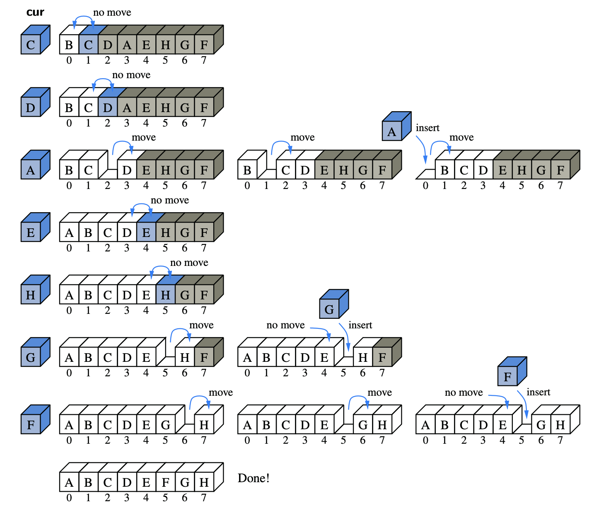

# Insertion Sort 3.1.2

## The insertion-Sort Algorithm

The algorithm proceeds by considering one element at a time, placing the element on the **correct order relative to those before it**. 

* Start with the first element in the array
* Consider the next element, if it's smaller than the first ➡ swap them.
* Consider the third element, swapping it leftward until it is in its proper order relative to the first two element.
* Continue...

```java
//Insertion-sort of an array of characters into nondecresing order
public static char[] insertion_sort(char[] data) {
		int n = data.length;
		for (int k = 1; k < n; k++) {			     //begin with second character
			char current = data[k];				       //time to insert current = data[k]
			int j = k;							             //find correct index j for current
			while(j>0 && data[j-1] > current) {	 //thus, data[j-1] must go after cur
				data[j] = data[j-1];			         //slide data[j-1] rightward
				j --;							                 //consider previous j for current
			}
			data[j] = current;					         //this is the proper place for cur
		}
		return data;
	}
```



