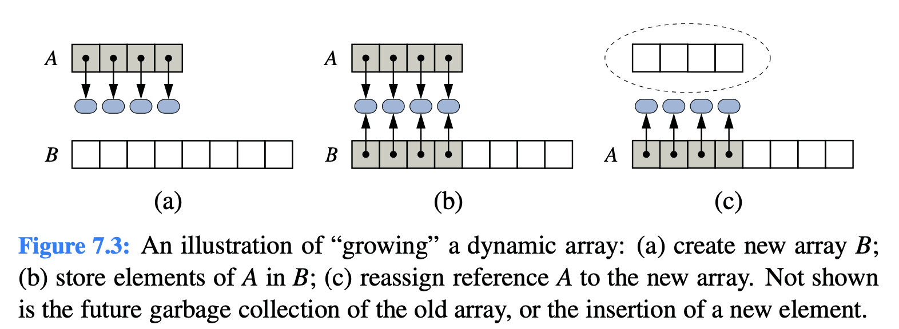

# 7.2.2 Implementing a Dynamic Array

A dynamic-array implementation, having unbounded capacity.

The key is to provide means to **“grow”** the array A, when more space is needed. Of course, we cannot actually grow that array, as **its capacity is fixed**. Instead, when a call to add a new element risks **overflowing** the current array, we perform the following additional steps:

1. Allocate a new array B with larger capacity.
2. Set B\[k\] = A\[k\], for k = 0 , ..., n−1, where n denotes current number of items.
3. Set A = B, that is, we henceforth use the new array to support the list.
4. Insert the new element in the new array.




```java
protected void resize(int capacity) {
  E[ ] temp = (E[ ]) new Object[capacity];  // safe cast; compiler may give warning 
  for (int k=0; k < size; k++)
    temp[k] = data[k];
  data = temp;                              // start using the new array
}
```



```java
public void add(int i, E e) throws IndexOutOfBoundsException {
  checkIndex(i, size + 1);
  if(size == data.length) // not enough capacity
    resize(2 ∗ data.length); // so double the current capacity 
    // rest of method unchanged...
```


