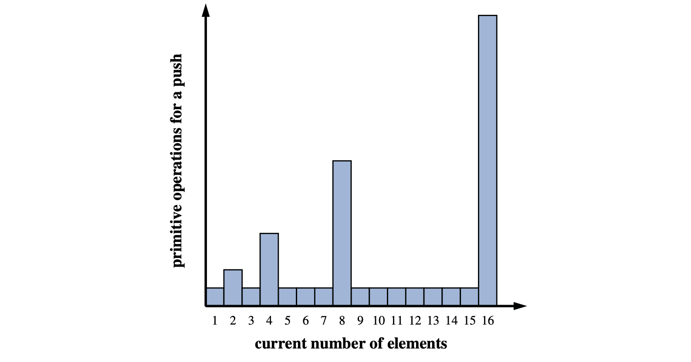
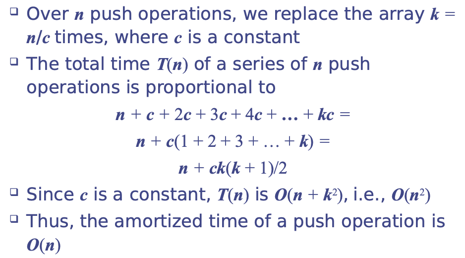
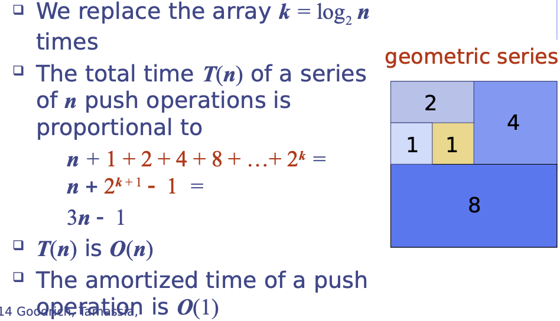

# 7.2.3 Amortized Analysis of Dynamic Arrays

The insertion of an element to be the last element in an array list as a **push** operation.

`push(o)` be the operation that adds elements o at the end of the list.

The strategy of replacing an array with a new, larger array might **at first seem slow**, because a single push operation may require Ω\(n\) time to perform, where n is the current number of elements in the array. 

However, by **doubling the capacity during an array replacement**, our new array allows us to add n further elements before the array must be replaced again.

## Growable Array List

How large should the new array be? 

* **Incremental strategy** :  increase the size be a constant c.
* **Doubling strategy** : double the size.

Compare incremental strategy and doubling strategy by analyzing the **total time** **T\(n\)** needed to perform a series of **n** **push operation**.

We assume that we start with an empty list represented by a growable array size 1.

**Amortized time** of a push operation that average time taken by push operation over the series of operations,  **T\(n\)/n**. 

### Incremental Strategy Analysis

### Doubling Strategy Analysis

