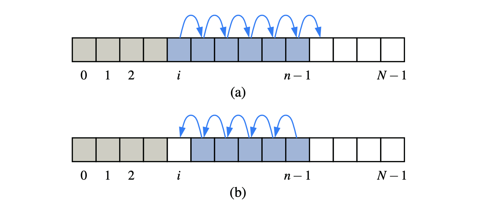

# 7.2 Array Lists

Use an array A for implementing the list ADT, where A\[i\] stores \(a reference to\) the element with index i.


Weakness of Array: a fixed-capacity. 


With a representation based on an array A, the **get\(i\) and set\(i, e\) methods are easy** to implement by accessing A\[i\].

Methods **add\(i, e\) and remove\(i\) are more time consuming**, as they require shifting elements up or down to maintain our rule of always storing an element whose list index is i at index i of the array.




```java
public class ArrayList<E> implements List<E> {
 // instance variables
 public static final int CAPACITY=16;   // default array capacity
 private E[ ] data;                     // generic array used for storage
 private int size = 0;                  // current number of elements
 
 // constructors
 public ArrayList() { this(CAPACITY); } // constructs list with default capacity
 public ArrayList(int capacity) {       // constructs list with given capacity
  data = (E[ ]) new Object[capacity];   // safe cast; compiler may give warning
 }
 // public methods
 /∗∗ Returns the number of elements in the array list. ∗/
 public int size() { return size; }
 
 /∗∗ Returns whether the array list is empty. ∗/
 public boolean isEmpty() { return size == 0; }
 
 /∗∗ Returns (but does not remove) the element at index i. ∗/
 public E get(int i) throws IndexOutOfBoundsException {
  checkIndex(i, size);
  return data[i]; 
 }
 
 /∗∗ Replaces the element at index i with e, and returns the replaced element. ∗/ 
 public E set(int i, E e) throws IndexOutOfBoundsException {
  checkIndex(i, size); E temp = data[i]; data[i] = e;
  return temp;
 }
 
 }
/∗∗ Inserts element e to be at index i, shifting all subsequent elements later. ∗/ 
public void add(int i, E e) throws IndexOutOfBoundsException, IllegalStateException {
 checkIndex(i, size + 1);
 if(size == data.length)                 // not enough capacity
   throw new IllegalStateException("Array is full");
 for (int k=size−1; k >= i; k−−)         // start by shifting rightmost
   data[k+1] = data[k];
   data[i] = e;                          // ready to place the new element size++;
 }
 
 /∗∗ Removes/returns the element at index i, shifting subsequent elements earlier. ∗/ 
 public E remove(int i) throws IndexOutOfBoundsException {
  checkIndex(i, size);
  E temp = data[i];
  for (int k=i; k < size−1; k++)         // shift elements to fill hole
    data[k] = data[k+1]; 
    data[size−1] = null;                 // help garbage collection
    size−−;
    return temp;                         
 }
 
 // utility method
 /∗∗ Checks whether the given index is in the range [0, n−1]. ∗/
 protected void checkIndex(int i, int n) throws IndexOutOfBoundsException {
  if(i < 0 || i >= n)
    throw new IndexOutOfBoundsException("Illegal index: " + i);
  }
 }
 
```


## The Performance of a Simple Array-Based Implementation

**The worst-case running times** of the methods of an array list with n elements realized by means of an array.


* **worst-case:** 
  * `add(i, e)` runs in time O\(n\), when _i_ = 0, all the existing n elements have to be shifted forward.
  * `remove(i)`, runs in O\(n\) time, when _i_ = 0, shift backward n − 1 elements.
*  **best-case:**
  * `add(n, e)` and `remove(n − 1)` takes O\(1\) time each, inserting or removing an item at the end of an array list. 
* **general-case:** 
  * `add(i, e)` and `remove(i),` each run in time O\(n − i + 1\), for only those elements at index i and higher have to be shifted up or down.

