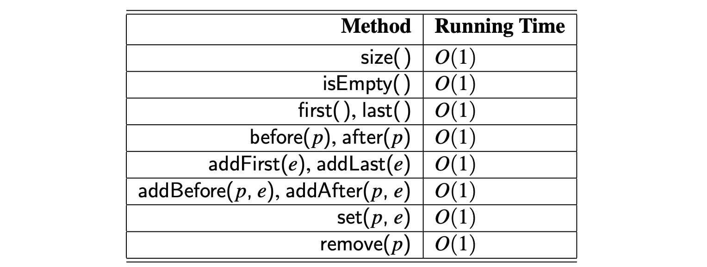

# 7.3.3 Doubly Linked List Implementation

Implementation of the **PositionalList interface** relies on a **doubly linked list.**


```java
public class LinkedPositionalList<E> implements PositionalList<E> {
  //---------------- nested Node class ----------------
  private static class Node<E> implements Position<E> {
    private E element;              // reference to the element stored at this node
    private Node<E> prev;           // reference to the previous node in the list
    private Node<E> next;           // reference to the subsequent node in the list
    public Node(E e, Node<E> p, Node<E> n) {
      element = e; 
      prev = p; 
      next = n;
    }
    public E getElement() throws IllegalStateException {
     if (next == null) // convention for defunct node 
     throw new IllegalStateException("Position no longer valid");
     return element; 
    }
    public Node<E> getPrev() { 
    return prev;
    }
    public Node<E> getNext() {
    return next; 
    }
    public void setElement(E e) { 
    element = e;
    }
    public void setPrev(Node<E> p) {
    prev = p;
    }
    public void setNext(Node<E> n) {
    next = n;
    }
  } //----------- end of nested Node class -----------
  
  // instance variables of the LinkedPositionalList
  private Node<E> header;                      // header sentinel
  private Node<E> trailer;                     // trailer sentinel
  private int size = 0;                        // number of elements in the list
  
  
  /** Constructs a new empty list. */ 
  public LinkedPositionalList( ) {
    header = new Node<>(null, null, null);     // create header
    trailer = new Node<>(null, header, null);  // trailer is preceded by header
    header.setNext(trailer);                   // header is followed by trailer
  }


// private utilities
/* Validates the position and returns it as a node. */
  private Node<E> validate(Position<E> p) throws IllegalArgumentException {
    if (!(p instanceof Node)) throw new IllegalArgumentException("Invalid p"); 
    Node<E> node = (Node<E>) p;   // safe cast
    if (node.getNext() == null) // convention for defunct node
       throw new IllegalArgumentException("p is no longer in the list"); 
       return node;
 }

/** Returns the given node as a Position (or null, if it is a sentinel). */ 
  private Position<E> position(Node<E> node) {
    if (node == header || node == trailer)
    return null;     // do not expose user to the sentinels
    return node; }


  // public accessor methods
  /** Returns the number of elements in the linked list. */ 
  public int size() { 
   return size; 
  }

  /** Tests whether the linked list is empty. */ 
  public boolean isEmpty() { 
   return size == 0; 
  }
  
  /** Returns the first Position in the linked list (or null, if empty). */ 
  public Position<E> first( ) {
   return position(header.getNext()); }

  /** Returns the last Position in the linked list (or null, if empty). */ 
  public Position<E> last( ) {
   return position(trailer.getPrev()); 
  }
  
  /** Returns the Position immediately before Position p (or null, if p is first). */ 
  public Position<E> before(Position<E> p) throws IllegalArgumentException {
   Node<E> node = validate(p);
   return position(node.getPrev()); 
  }

  /** Returns the Position immediately after Position p (or null, if p is last). */ 
  public Position<E> after(Position<E> p) throws IllegalArgumentException {
   Node<E> node = validate(p);
   return position(node.getNext()); 
  }
  
  
  // private utilities
  /** Adds element e to the linked list between the given nodes. */
  private Position<E> addBetween(E e, Node<E> pred, Node<E> succ) {
     Node<E> newest = new Node<>(e, pred, succ); // create and link a new node pred.setNext(newest);
     succ.setPrev(newest);
     size++;
     return newest; 
  }
  
  // public update methods
  /** Inserts element e at the front of the linked list and returns its new Position. */ 
  public Position<E> addFirst(E e) {
    return addBetween(e, header, header.getNext());  // just after the header }

  /** Inserts element e at the back of the linked list and returns its new Position. */ 
  public Position<E> addLast(E e) {
    return addBetween(e, trailer.getPrev(), trailer); // just before the trailer }

  /** Inserts element e immediately before Position p, and returns its new Position.*/ 
  public Position<E> addBefore(Position<E> p, E e) throws IllegalArgumentException { 
    Node<E> node = validate(p);
    return addBetween(e, node.getPrev(), node); 
  }
  
  /** Inserts element e immediately after Position p, and returns its new Position. */ 
  public Position<E> addAfter(Position<E> p, E e）throws IllegalArgumentException { 
    Node<E> node = validate(p);
    return addBetween(e, node, node.getNext()); 
    }
    
  /** Replaces the element stored at Position p and returns the replaced element. */ 
  public E set(Position<E> p, E e) throws IllegalArgumentException {
    Node<E> node = validate(p); E answer = node.getElement(); node.setElement(e);
    return answer;
  }
  
  /** Removes the element stored at Position p and returns it (invalidating p). */ 
  public E remove(Position<E> p) throws IllegalArgumentException {
    Node<E> node = validate(p); 
    Node<E> predecessor = node.getPrev(); 
    Node<E> successor = node.getNext(); 
    predecessor.setNext(successor); 
    successor.setPrev(predecessor);
    size−−;
    E answer = node.getElement(); 
    node.setElement(null);       // help with garbage collection
    node.setNext(null);          // and convention for defunct node
    node.setPrev(null);
    return answer;
  }
 }
 
```


### The performance of a Linked Positional List

The positional list ADT is ideally suited for implementation with a doubly linked list.


All operations run in **worst-case constant time.**




### 


