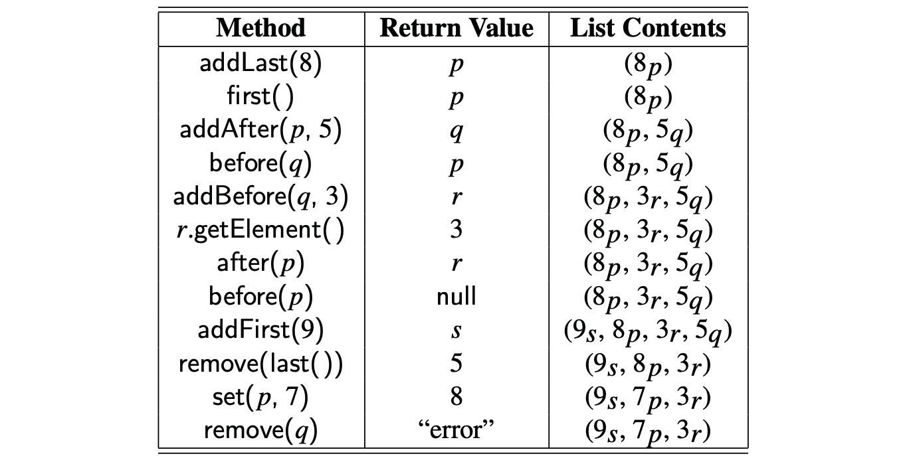

# 7.3.2 Positional Lists

We view a **positional list** as a collection of positions, each of which stores an element.

* `first():`Returns the position of the first element of L \(or null if empty\).
* `last():`Returns the position of the last element of L \(or null if empty\).
* `before(p):`Returns the position of L immediately before position p \(or null if p is the first position\).
* `after(p):`Returns the position of L immediately after position p \(or null if p is the last position\).
* `isEmpty():`Returns true if list L does not contain any elements.
* `size():`Returns the number of elements in list L.
* `addFirst(e):`Inserts a new element e at the front of the list, returning the

  position of the new element.

* `addLast(e):`Inserts a new element e at the back of the list, returning the position of the new element.
* `addBefore(p,e):`Inserts a new element e in the list, just before position p, returning the position of the new element.
* `addAfter(p,e):`Inserts a new element e in the list, just after position p, returning the position of the new element.
* `set(p, e):`Replaces the element at position p with element e, return- ing the element formerly at position p.
* `remove(p):`Removes and returns the element at position p in the list, invalidating the position.


```java
Position<String> cursor = guests.first();
while (cursor != null) {
 System.out.println(cursor.getElement( ));
 cursor = guests.after(cursor); // advance to the next position (if any)
}
```




### JAVA Interface Definition


```java
public interface PositionalList<E> {
  
  /** Returns the number of elements in the list. */
  int size( );
  
  /** Tests whether the list is empty. */
  boolean isEmpty( );
  
  /** Returns the first Position in the list (or null, if empty). */ 
  Position<E> first( );
  
  /** Returns the last Position in the list (or null, if empty). */ 
  Position<E> last( );
  
  /** Returns the Position immediately before Position p (or null, if p is first). */ 
  Position<E> before(Position<E> p) throws IllegalArgumentException;
  
  /** Returns the Position immediately after Position p (or null, if p is last). */
  Position<E> after(Position<E> p) throws IllegalArgumentException;
  
  
  /** Inserts element e at the front of the list and returns its new Position. */
  Position<E> addFirst(E e);
  
  /** Inserts element e at the back of the list and returns its new Position. */
  Position<E> addLast(E e);
  
  /** Inserts element e immediately before Position p and returns its new Position. */
  Position<E> addBefore(Position<E> p, E e)
    throws IllegalArgumentException; 
  
  /** Inserts element e immediately after Position p and returns its new Position. */
  Position<E> addAfter(Position<E> p, E e)
    throws IllegalArgumentException;
  
  /** Replaces the element stored at Position p and returns the replaced element. */
  E set(Position<E> p, E e) throws IllegalArgumentException;
  
  /** Removes the element stored at Position p and returns it (invalidating p). */
  E remove(Position<E> p) throws IllegalArgumentException;
}


```


