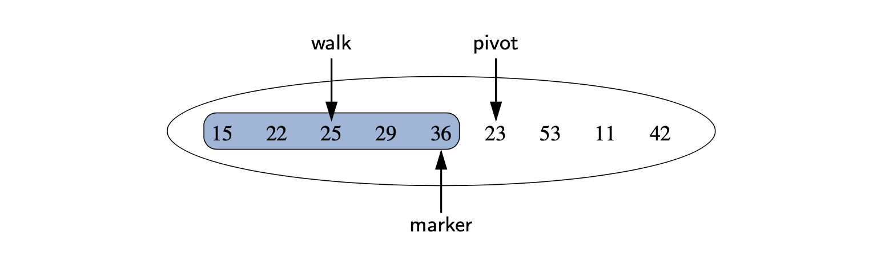

# 7.6 Sorting a Positional List

 Implementation insertion-sort on a PositionalList.

* **marker :** represents the rightmost position of the currently sorted portion of a list.
* **pivot** : position just past the marker, consider where the pivot’s element belongs relative to the sorted portion.
* **walk :** move leftward from the marker, as long as there remains a preceding element with value larger than the pivot’s.




```java
public static void insertionSort(PositionalList<Integer> list) {
  Position<Integer> marker = list.first();   // last position known to be sorted
  while (marker != list.last()) {
    Position<Integer> pivot = list.after(marker);
    int value = pivot.getElement();          // number to be placed
    if (value > marker.getElement())         // pivot is already sorted
    marker = pivot;
  else {                                     // must relocate pivot
    Position<Integer> walk = marker;
    while (walk != list.first() && list.before(walk).getElement() > value)
      walk = list.before(walk);
      list.remove(pivot);                   // remove pivot entry and 
      list.addBefore(walk, value);          // reinsert value in front of walk
    } 
  }
}
  
```


