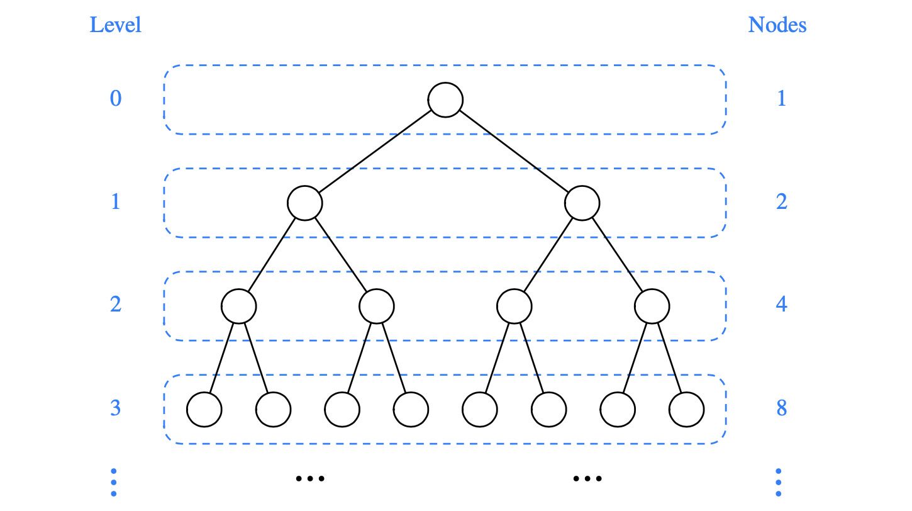
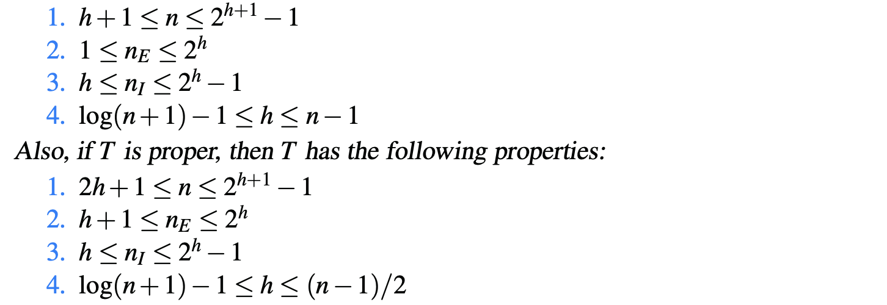

# 8.2.2 Properties of Binary Trees

We denote the set of all nodes of a tree **T** at the same depth d as **level** d of T .

The **maximum number** of nodes on the levels of a binary tree grows **exponentially** as we go down the tree.

Let T be a nonempty binary tree, and let _n_,  $$n_E$$ ,  $$n_I$$ , and _h_ denote the number of nodes, number of external nodes, number of internal nodes, and height of _T_

### Relating Internal Nodes to External Nodes in a Proper Binary Tree

In a **nonempty proper** binary tree _**T**_ ****, with $$n_E$$ external nodes and $$n_I$$ internal nodes, we have $$n_E = n_I +1$$ .

