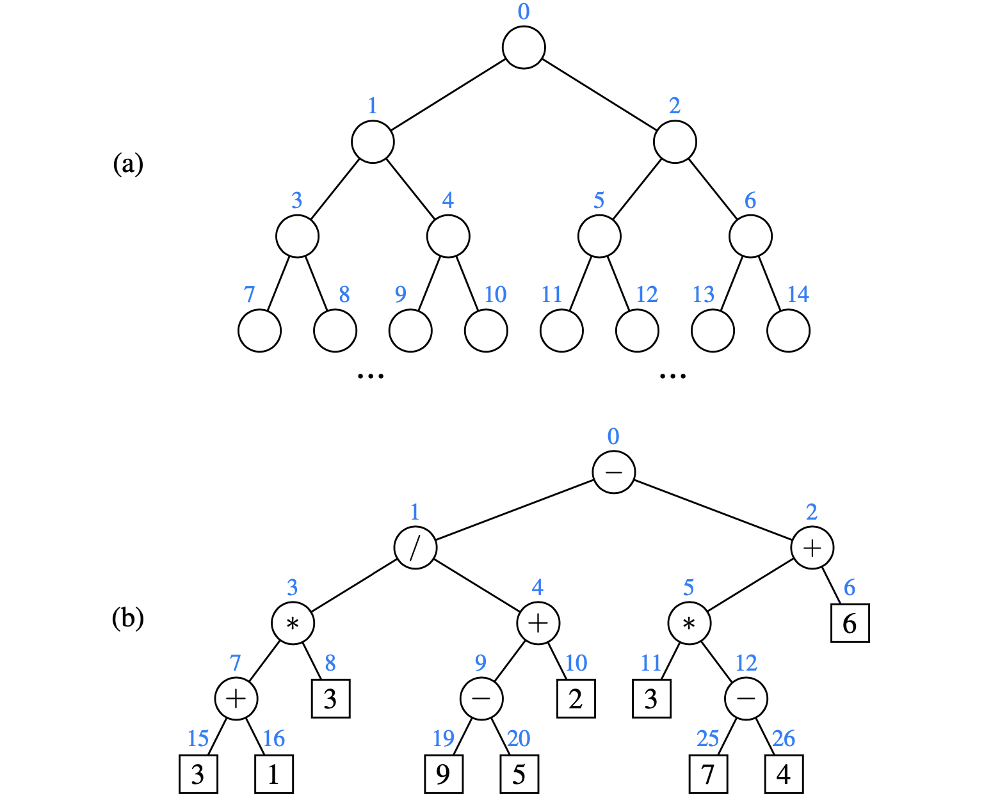
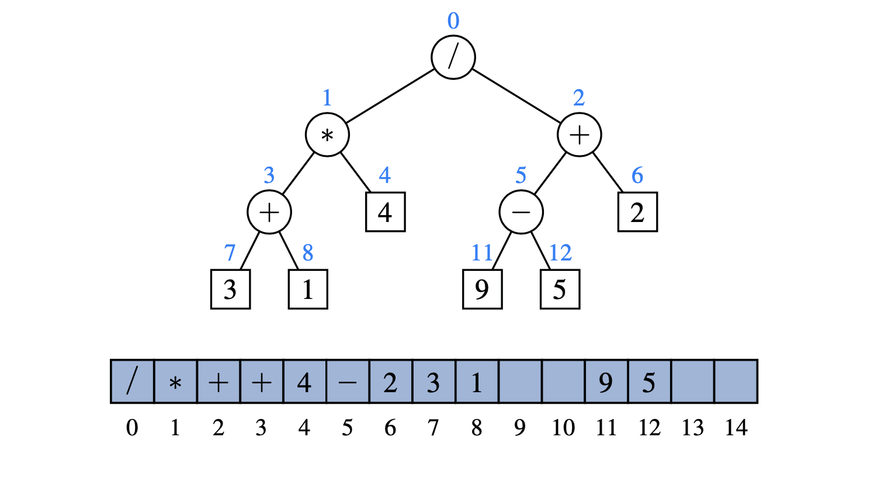

# 8.3.2 Array-Based Representation of a Binary Tree

An alternative representation of a binary tree T is based on a way of **numbering the positions** of T .

* If p is the root of T, then f\(p\)=0.
* If p is the left child of position q, then f\(p\) = 2f\(q\)+1. 
* If p is the right child of position q, then f\(p\) = 2f\(q\)+2.

The numbering function f is known as a **level numbering** of the positions in a binary tree T , for it numbers the positions on each level of T in increasing order from left to right.

The level numbering function f suggests a representation of a binary tree T by means of an **array-based structure** A, with the element at position p of T stored at index f\(p\) of the array.

* Advantage:
  * Simple arithmetic operations on the number f\(p\): 
    * left child of p has index 2_f_ \(p\)+1
    * right child of p has index 2_f_ \(p\)+2
    * parent of p has index \[\( _f_ \( p\) − 1\)/2\]
* Drawbacks:
  * space usage, in the worst case, N = 2n − 1
  * update operations for trees cannot be efficiently supported.
    * **removing** a node and **promoting** its child takes **O\(n\) time**

