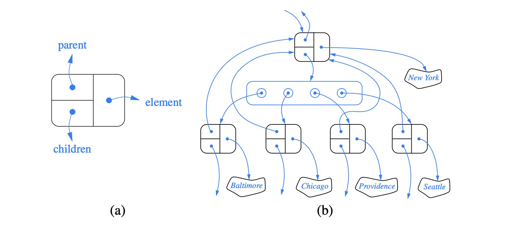
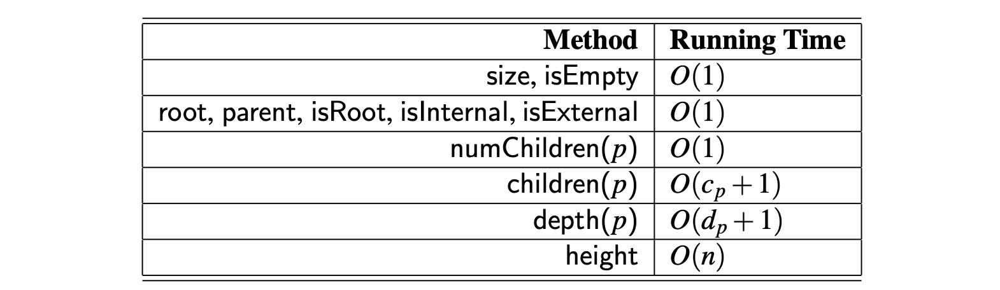

# 8.3.3 Linked Structure for General Trees

Realize a **general tree** T as a linked structure is to have each node store a single _**container**_ of references to its children.

### Performance of the implementation of a general tree using a linked structure

The space usage is O\(n\).

