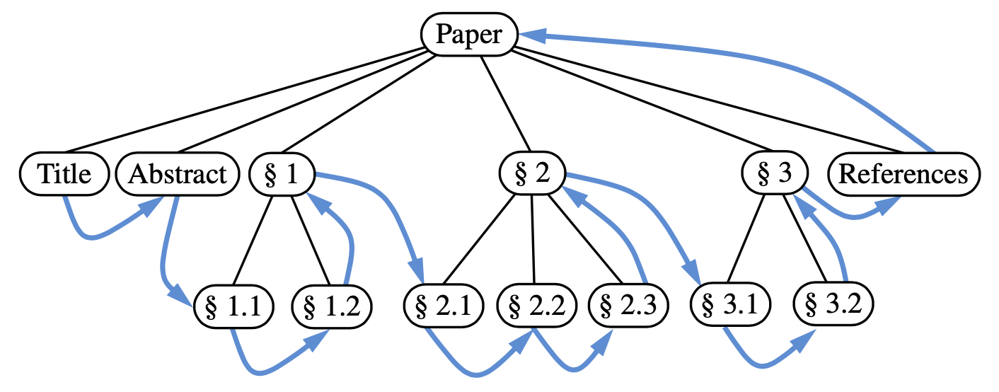

# 8.4.1Preorder and Postorder Traversals of General Trees

### Preorder Traversal

In a **preorder traversal** of a tree T , the **root** of T is visited **first** and **then** the sub-trees rooted at its **children** are traversed recursively.


**Preorder: n ➡️ l ➡️ r** 


\*\*\*\*

### Postorder Traversal

The **postorder traversal**, it recursively traverses the subtrees rooted at the **children** of the root **first**, and **then** visits the **root.**


**Postorder: l ➡️ r ➡️ n**


### **Running-Time Analysis**

At each position p, the nonrecursive part of the traversal algorithm requires time $$O_(c_p +1)$$ __, where cp is the number of children of p, under the assumption that the “visit” itself takes O\(1\) time.

The overall running time for the traversal of tree T is O\(n\), where n is the number of positions in the tree

