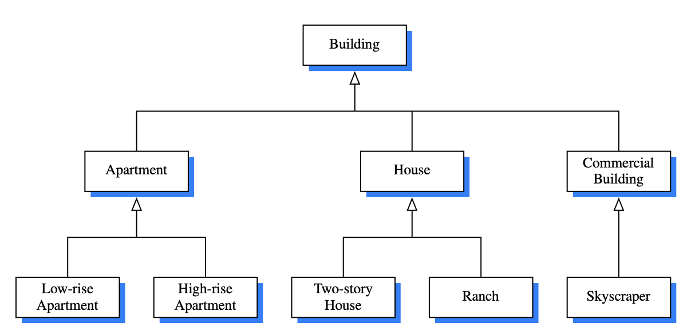

# 2.2 Inheritance

A natural way to organize various structural components of a software package is in a **hierarchical** fashion, with similar abstract definitions grouped together in a level-by-level manner that goes from specific to more general as one traverses up the hierarchy. 

The correspondence between levels is often referred to as **an “is a” relationship,** as a house is a building, and a ranch is a house. 

