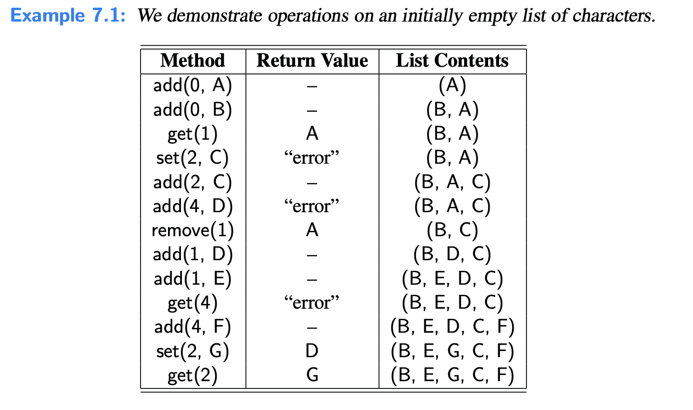

# 7.1 The List ADT

Java defines a general interface, java.util.List, that includes the following index-based methods \(and more\):

* `size():`Returns the number of elements in the list.
* `isEmpty():`Returns a boolean indicating whether the list is empty.
* `get(i)`:Returns the element of the list having index i; an error condition occurs if i is not in range \[0, size\( \) − 1\].
* `set(i,e):` Replaces the element at index i with e, and returns the old element that was replaced; an error condition occurs if i is not in range \[0, size\( \) − 1\].
* `add(i, e):`Inserts a new element e into the list so that it has index i, _**moving all subsequent elements one index later in the list**_; an error condition occurs if i is not in range \[0, size\(\)\].
* `remove(i):`Removes and returns the element at index i, _**moving all subsequent elements one index earlier in the list**_; an error condition occurs if i is not in range \[0, size\( \) − 1\]. 



```java
/∗∗ A simplified version of the java.util.List interface. ∗/
public interface List<E> {
    /∗∗ Returns the number of elements in this list. ∗/
    int size();
    
    /∗∗ Returns whether the list is empty. ∗/
    boolean isEmpty();
    
    /∗∗ Returns (but does not remove) the element at index i. ∗/
    E get(int i) throws IndexOutOfBoundsException;
    
    /∗∗ Replaces the element at index i with e, and returns the replaced element. ∗/
    E set(int i, E e) throws IndexOutOfBoundsException;
    
    /∗∗ Inserts element e to be at index i, shifting all subsequent elements later. ∗/
    void add(int i, E e) throws IndexOutOfBoundsException;
    
    /∗∗ Removes/returns the element at index i, shifting subsequent elements earlier. ∗/
    E remove(int i) throws IndexOutOfBoundsException;
}
```


