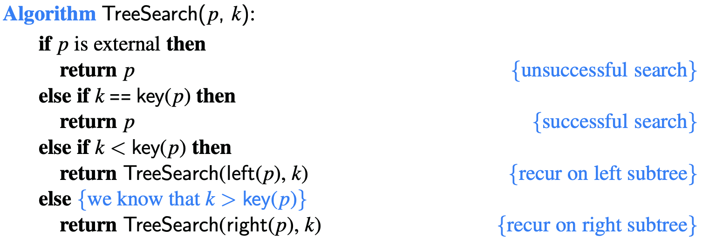
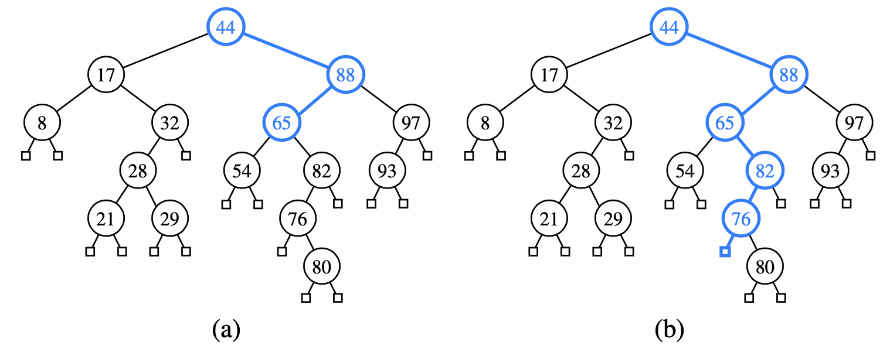
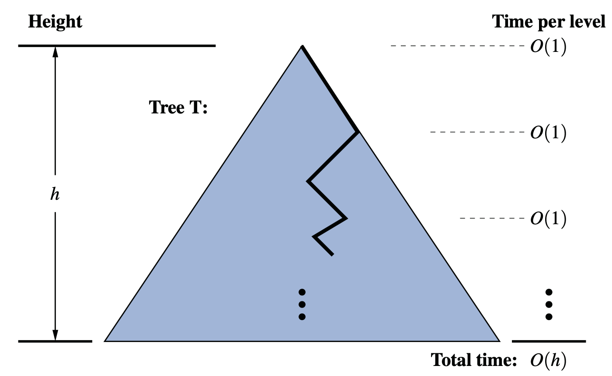

# 11.1.1 Searching Within a Binary Search Tree

Search algorithm in binary search tree. The question asked at each internal position p is whether the desired key k is less than, equal to, or greater than the key stored at position p, which we denote as key\(p\).

### Analysis of Binary Tree Searching

The **worst-case running time** of searching in a binary search tree T is **O\(h\) time**, where h is the height of the binary search tree T.

