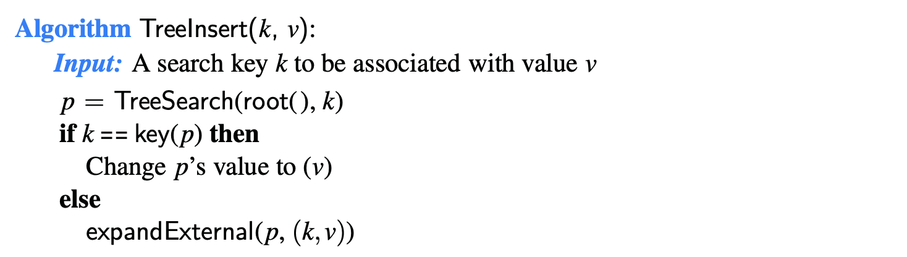

# 11.1.2 Insertions and Deletions

## Insertion

The map operation **put\(k, v\)** begins with a search for an entry with **key k.**

* If found, that entry’s existing value is **reassigned**. 
* Otherwise, the new entry can be inserted into the underlying tree by expanding the leaf that was reached at the end of the failed search into an internal node.

**`expandExternal(p, e):`** Stores entry e at the external position p, and expands p to be internal, having two new leaves as children.

## Deletion

To delete an entry with key k, we begin by calling TreeSearch\(root\(\), k\) to find the position p storing an entry with key equal to k \(if any\). 

* If the search returns an external node, then there is no entry to remove. 
* Otherwise, we distinguish between two cases \(of increasing difficulty\):
  * If **at most one of the children** of position p is **internal**
    * Let position r be a child of p that is internal
    * remove p and the leaf that is r’s sibling, while promoting r upward to take the place of p.
  * If position p has **two children**, we cannot simply remove the node from the tree since this would create a “hole” and two orphaned children.
    * 

