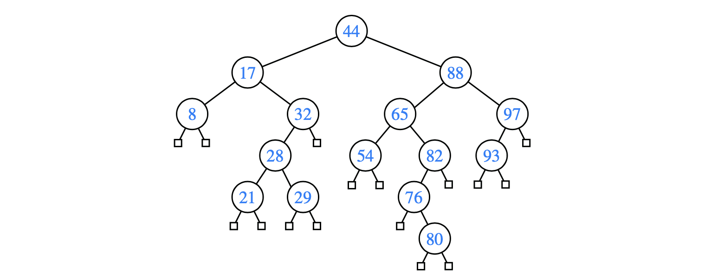

# 11.1 Binary Search Trees

We use a search-tree structure to efficiently implement a **sorted map.**

* **`get(k):`** Returns the value v associated with key k, if such an entry exists; otherwise returns null.
* **`put(k, v)：`**Associates value v with key k, replacing and returning any existing value if the map already contains an entry with key equal to k.
* **`remove(k):`** Removes the entry with key equal to k, if one exists, and returns its

  value; otherwise returns null.

**Binary search tree** as a proper binary tree  such that each internal position p stores a key-value pair \(k,v\) such that:

* Keys stored in the left subtree of p are less than k.
* Keys stored in the right subtree of p are greater than k.

he **leaves** of the tree serve only as “placeholders.” 

hey can be represented as **null references** in practice, thereby reducing the number of nodes in half \(since there are more leaves than internal nodes in a proper binary tree\).

  

  

