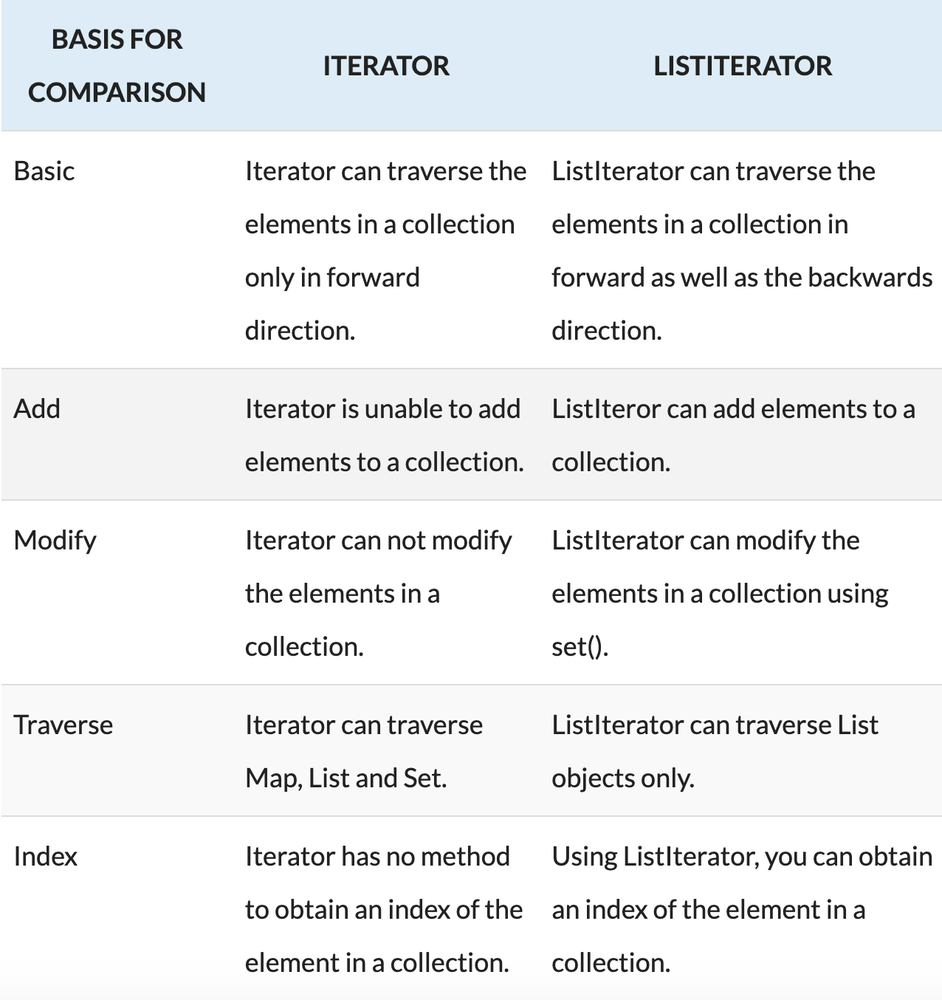

# Iterators 20.3

**Iterator** is a classic design pattern for walking through a data structure without having to expose the details of how data is stored in the data structure.

The **Collection** interface extends the **Iterable** interface. The **Iterable** interface defines the iterator method, which returns an iterator.

* **`iterator()`** method in the Iterable interface returns an instance of Iterator
* **`next()`** method provides sequential access to the elements in the collection
* **`hasNext()`** method to check whether there are more elements in the iterator
* **`remove()`** method to remove the last element returned by the iterator

```java
import java.util.*;

public class Iteratos {
	public static void main(String[] args) {
		//Creat arraylist
		ArrayList<String> collection = new ArrayList<>(); 
		
		//Add elements
		collection.add("a");
		collection.add("b");
		collection.add("c");
	
		
		Iterator<String> iterator = collection.iterator(); //iterator() method
		while (iterator.hasNext()) { //hasNext() method
			System.out.println(iterator.next()); //next() method
		}
		
		//foreach loop
		for (String element : collection) {
			System.out.println(element);
		}
	}
}
```


**remove method cannot be invoked** when using the **for-each loop** syntax ❌

Must use an **Iterator ✅**



```java
ArrayList<Double> data; // populate with random numbers (not shown) 
Iterator<Double> walk = data.iterator();
while (walk.hasNext())
 if(walk.next() < 0.0)
    walk.remove( );
```



**Iterator** cannot Modify or Add elements in the collection. 

`while(iterator.hasNext()){ collection.add(a);} ❌`



**ListIterator** can Modify or Add elements in the collection.


```java
ListIterator<Integer> liter = collection.listIterator();
while(liter.hasNext()) {
  liter.add(4);
  System.out.print (liter.next());  
  System.out.print (" ");
 }
```



